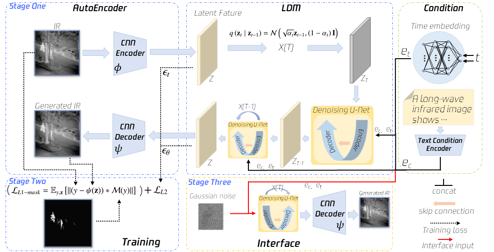
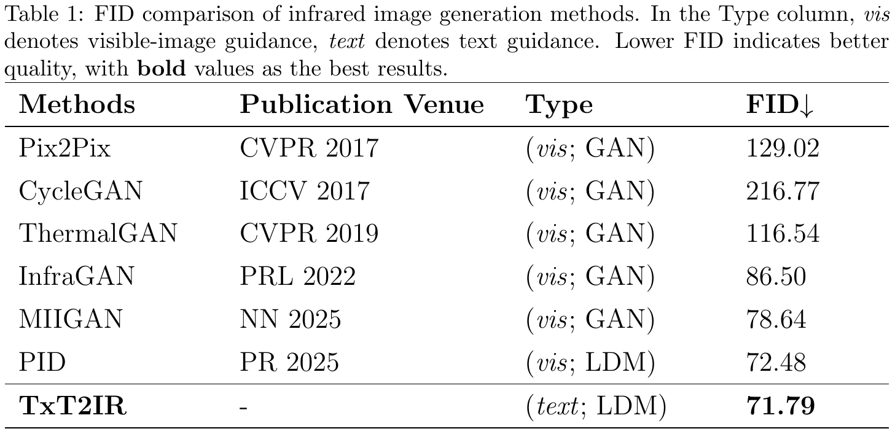

# <h1 align = "center">TxT2IR: Text-to-Infrared image generation via thermal mask constraints in cross-modal learning</h1>

Fuchao Wanga, Jian Fangb, Pengfei Liub, Ronghua Zhanga, Yuhuai Penga,c,*, 
Huaici Zhaoa,b,*

a.School of Computer Science and Engineering,  Northeastern University, Shenyang, Liaoning, China

b.Shenyang Institute of Automation, Chinese Academy of Sciences, Shenyang, Liaoning, China

c.Strategic Research Department, Zhiyuan Research Institute, Hangzhou, Zhejiang, China

**Abstract** To address the poor quality of infrared images generated from visible images under low-light conditions, we propose TxT2IR, a latent diffusion model (LDM) framework guided by cross-modal textual information, aiming to improve the quality and thermal radiation consistency of generated infrared images. Specifically, (1) we construct TxT2IR-dataset, the first open-source text-infrared paired dataset for low-light scenarios, based on the LLVIP dataset; (2) we introduce a physically-aware thermal mask mechanism inspired by infrared imaging principles and integrate it into the LDM’s loss function to enhance the thermal radiation consistency of generated infrared images; (3) we develop an end-to-end text-driven diffusion architecture, TxT2IR, tailored for infrared image generation. Experimental results show that TxT2IR achieves a state-of-the-art FID score of 71.79, enhancing the quality and thermal radiation consistency of the generated infrared images. Moreover, it further demonstrates competitive performance in downstream object detection tasks. This work offers a novel technical pathway for research in infrared image generation.

<h2>Architecture</h2>

<h2>Results</h2>

[dataset](https://drive.google.com/file/d/1K-CKfZ5dB8IaO-XdZtBCsXdd5ZEv-8eE/view?usp=drive_link)
(contact us: 2390229@stu.neu.edu.cn)
