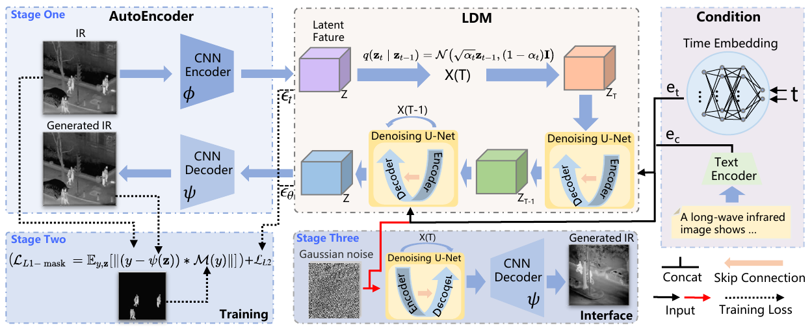
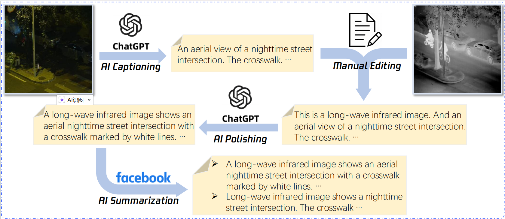
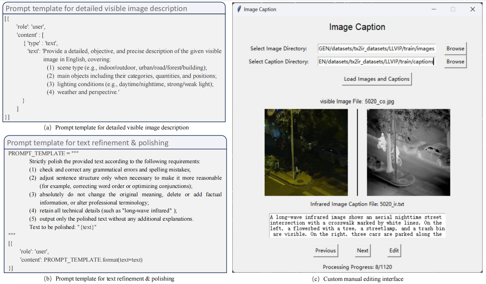
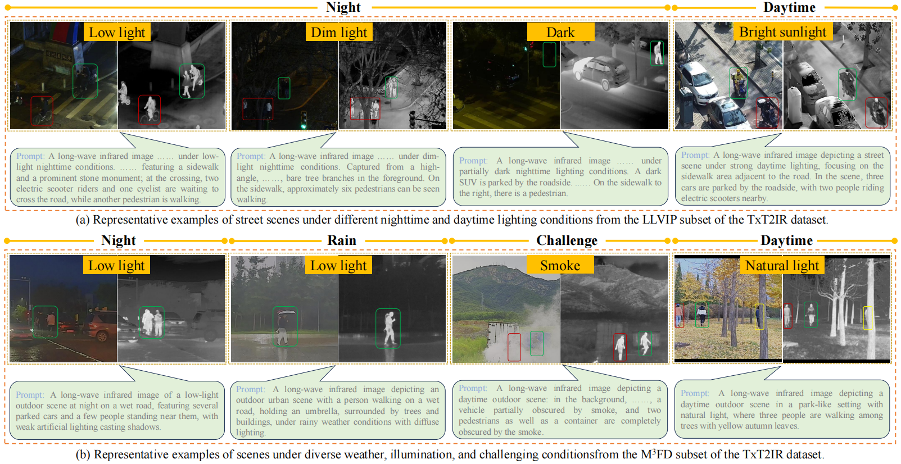
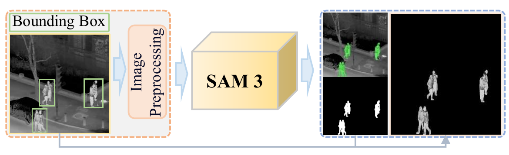
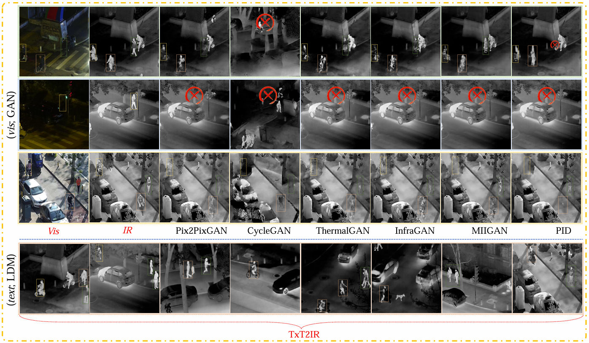
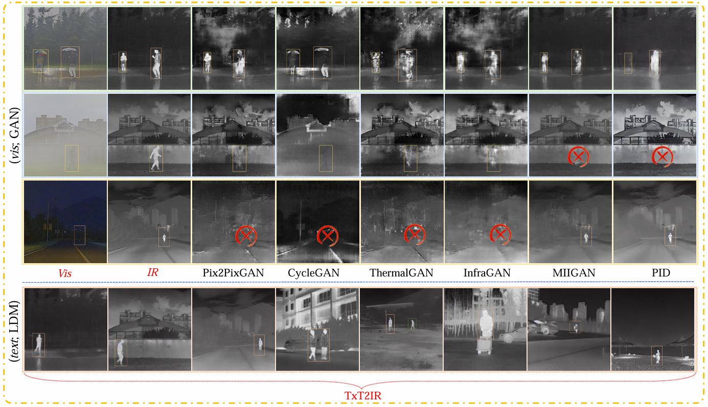

# <h1 align = "center">TxT2IR: Text-to-Infrared image generation via thermal mask constraints in cross-modal learning</h1>

Fuchao Wanga, Jian Fangb, Pengfei Liub, Ronghua Zhanga, Yuhuai Penga,c,*, Huaici Zhaoa,b,*

a.School of Computer Science and Engineering,  Northeastern University, Shenyang, Liaoning, China

b.Shenyang Institute of Automation, Chinese Academy of Sciences, Shenyang, Liaoning, China

c.Strategic Research Department, Zhiyuan Research Institute, Hangzhou, Zhejiang, China

**Abstract** To address the poor quality of infrared images generated from visible images under low-light conditions, we propose TxT2IR, a Latent Diffusion Model (LDM) framework guided by cross-modal textual information. 
Specifically, 
(1) we develop an end-to-end text-driven diffusion architecture, TxT2IR, tailored for infrared image generation; 
(2) we construct TxT2IR-dataset, an open-source paired text-infrared dataset for low-light scenarios; 
(3) we introduce a physics-aware thermal mask mechanism and integrate it into the loss function to enhance the thermal radiation consistency.
Extensive experiments demonstrate that TxT2IR not only achieves satisfactory results on the FID and CLIPScore metrics, validating the effectiveness of the proposed method, but also enhances the quality and thermal radiation consistency of infrared images generated under low-light conditions. Furthermore, TxT2IR-generated infrared images exhibit competitive performance in downstream object detection tasks. This study provides a novel technical avenue for research in the field of infrared image generation. 

<h2> 
 TxToIR Overview 
 </h2>

<h2> 
 TxT2IR-dataset 
 </h2>  

### Construction of the TxT2IR-dataset

#### Preview

### Construction of the Thermal mask

### Experiments

### Download

- [Google Drive]()
- [Baidu Yun](https://pan.baidu.com/s/16vdHC8ktUI-hDZGfLnkTkQ?pwd=gq4y)

If you have any question or suggestion about the dataset, please email to [Wang Fuchao](mailto:2390229@stu.neu.edu.cn).

